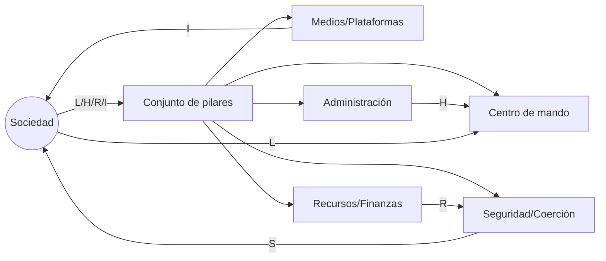

# De la dictadura a la democracia (Gene Sharp) — **Teoría, método y preparación estratégica de una revolución no violenta**
> **Documento-base para ponencia mundial / marco de tesis**  
> **Tesis central:** el poder político no es un “bloque de granito”; es una **red de dependencias**. Si la sociedad **retira cooperación** de forma planificada, disciplinada y escalonada, el régimen pierde sustentación y se vuelve vulnerable al cambio.

---

## Tabla de contenido
1. **Resumen ejecutivo**
2. **La tesis madre de Sharp: el poder es relacional**
3. **Arquitectura del poder: fuentes, pilares y legitimidad**
4. **No violencia como tecnología social (no como romanticismo)**
5. **El “arsenal” de acción: 3 familias (y para qué sirve cada una)**
6. **Estrategia vs. táctica: cómo se piensa una revolución**
7. **Preparación: el “laboratorio oculto” antes de la calle**
8. **Diseño de campañas: objetivos, secuencias, escalamiento**
9. **Gestión de represión: el judo político y el efecto búmeran**
10. **Fractura y realineamiento: cómo cambian las lealtades**
11. **Negociación y transición: ganar no es gobernar**
12. **Institucionalización democrática: del derribo a la construcción**
13. **Errores fatales y mitos**
14. **Métricas y señales de salud del movimiento**
15. **Aplicación a revolución ideológica/cultural (sin violencia)**
16. **Marco de tesis (estructura sugerida)**
17. **Conclusiones para ponencia global**
18. **Anexos: mapas, plantillas y guías de análisis**

---

# 1) Resumen ejecutivo
Gene Sharp no vende “inspiración”; ofrece **ingeniería de cambio político sin violencia**. Su propuesta puede leerse como un manual de **arquitectura estratégica**: identificar **de dónde viene el poder**, ubicar **pilares** (instituciones y grupos que lo sostienen), y diseñar campañas que corten **obediencia, recursos, legitimidad y capacidad operativa**. Las “198 tácticas” (métodos) no son el corazón del libro: son el **inventario de herramientas**. El corazón es la **teoría del poder + estrategia de erosión gradual + disciplina colectiva**.

---

# 2) La tesis madre de Sharp: el poder es relacional
## 2.1 El poder no “habita” en el dictador
- No es una sustancia que alguien “posee” para siempre.
- Es un **contrato social forzado** sostenido por:
  - obediencia (miedo/hábito/beneficio),
  - cooperación (trabajo, impuestos, información),
  - legitimidad (creencias, propaganda),
  - aparato coercitivo (policía/ejército) que también depende de personas.

## 2.2 La revolución como **reconfiguración de dependencias**
Imagina el régimen como un sistema distribuido:
- **Nodo central:** cúpula.
- **Infraestructura:** instituciones, burocracia, finanzas, medios, fuerzas armadas.
- **Energía:** cooperación cotidiana de la sociedad.

La resistencia no violenta apunta a **desconectar la energía**: no por caos, sino por **estrategia**.

> **Analogía software:** no “matas el servidor” (violencia); **revocas credenciales**, **cortas integraciones**, **apagas jobs críticos**, y el sistema deja de ejecutar órdenes.

---

# 3) Arquitectura del poder: fuentes, pilares y legitimidad
## 3.1 Fuentes típicas del poder (en clave Sharp)
- **Autoridad/legitimidad** (creída o impuesta)
- **Recursos humanos** (funcionarios, técnicos, burócratas)
- **Conocimiento y habilidades** (expertise del Estado/élite)
- **Factores intangibles** (miedo, resignación, costumbre)
- **Recursos materiales** (dinero, logística, infraestructura)
- **Sanciones** (capacidad de castigar)

## 3.2 “Pilares de apoyo”
Un régimen no cae por discursos: cae cuando **pilares** se agrietan:
- sindicatos cooptados,
- gremios empresariales,
- universidades,
- iglesias,
- medios,
- fuerzas armadas,
- poder judicial,
- burocracia territorial.

### Regla de oro
> **No atacas “todo”; atacas lo que sostiene todo.**  
> El objetivo es que pilares “neutrales” pasen a neutrales reales, y luego a favor del cambio.

---

# 4) No violencia como tecnología social
## 4.1 No violencia ≠ pasividad
- Es **conflicto** sin destrucción física.
- Requiere más disciplina que la violencia, porque la violencia es un atajo emocional; la no violencia es un **método**.

## 4.2 Por qué funciona (cuando funciona)
- Reduce costos morales y políticos de sumarse.
- Amplía coaliciones (incluye moderados).
- Aumenta probabilidad de fractura del aparato represivo.
- Produce “**contradicción visible**”: un régimen que golpea a civiles desarmados pierde legitimidad (internamente y afuera).

---

# 5) El “arsenal” de acción: 3 familias (y para qué sirve cada una)
###################################

Que sugieres añadir que sea una sugerencia superdotada de ingenio?

Propongo mantener la idea del “Compilador de Revolución (CR)” como un anexo claro, conciso y estructurado. He limpiado duplicados y dejo aquí una versión pulida y lista para pegar:

## Anexo X — El “Compilador de Revolución” (CR)
**Ingeniería estratégica del cambio social no violento**

Este anexo formaliza el marco de Sharp como un modelo auditable y replicable: grafo de dependencias, lenguaje de campañas, pipeline de despliegue social y matriz de modos de falla.

### X.1 Idea núcleo
- Sharp entrega el qué y el porqué; el CR añade el cómo mediante arquitectura, medición y protocolos éticos.

### X.2 Grafo de Dependencias del Poder (GDP)
- Nodos: pilares (medios, fuerzas, burocracia, universidades, iglesias, finanzas, etc.).
- Aristas: flujos de legitimidad, recursos, humanos, información y sanción.
- Pesos: criticidad (0–1), substituibilidad, tiempo de recuperación.



### X.3 DSL de campañas (plantilla)
- Una campaña es un programa compuesto por: meta medible, pilares objetivo, hipótesis causal, fases, señales y salida.

Ejemplo (YAML):
```yaml
campaña:
  nombre: "PENDIENTE"
  meta:
    problema: "PENDIENTE"
    objetivo_medible: "PENDIENTE"
  pilares_objetivo:
    - pilar: "Medios"
      dependencias_clave: ["I","L"]
  hipotesis_causal: "Si... entonces..."
  principios: [NoViolencia, Veracidad, Proteccion]
  fases:
    - fase: F1
      metodos: [Persuasión]
    - fase: F2
      metodos: [NoCooperacion]
  señales:
    metricas: [adhesion, credibilidad]
    umbrales: {escalar: 0.6, desescalar: 0.2}
  salida: Reforma/Transición
```

### X.4 Pipeline CI/CD social (alto nivel)
- Diseñar → Entrenar → Piloto (canary) → Evaluar → Escalar/Refactor → Consolidar → Transición.
- Tests esenciales: unit (ética), integration (coordinación), canary (piloto controlado), rollback (protocolo de desescalado).

### X.5 FMEA — Modos de falla y controles rápidos
- Fragmentación interna → control: DSL + metas claras.
- Personalismo → control: liderazgo distribuido y redundancia.
- Deriva violenta → control: protocolos, entrenamiento y rollback.
- Fatiga/burnout → control: cuidado comunitario y ritmos sostenibles.
- Desinformación → control: verificación y rectificación pública.

### X.6 Cierre: reglas de oro del CR
- Priorizar palancas de alto impacto sistémico y bajo costo social.
- Medir con honestidad; pilotar antes de escalar.
- Diseñar la transición desde el inicio.

Si quieres, pego este Anexo directamente en la posición que prefieras del archivo, o lo extiendo con la matriz FMEA, plantillas listas para diapositivas y diagramas en mermaid adicionales.

#### Tipos de dependencia (etiquetas recomendadas)
- `L` = Legitimidad (prestigio, autoridad moral, narrativa)
- `R` = Recursos (finanzas, acceso, infraestructura)
- `H` = Humanos (personal, experticia, burocracia)
- `I` = Información (medios, propaganda, datos, educación)
- `S` = Sanción (capacidad de castigo/coerción; se modela como “capacidad” que también depende de humanos/legitimidad/recursos)

### X.2.2 Representación visual (plantilla)
```mermaid
flowchart LR
Pueblo((Sociedad)) -->|L/H/R/I| Pilares[Conjunto de pilares]
Pilares --> Estado[Centro de mando]
Pilares --> Medios[Medios/Plataformas]
Pilares --> Economia[Recursos/Finanzas]
Pilares --> Buro[Administración]
Pilares --> Fuerza[Seguridad/Coerción]
Medios -->|I| Pueblo
Economia -->|R| Fuerza
Buro -->|H| Estado
Fuerza -->|S| Pueblo
Pueblo -->|L| Estado


Añadiría una pieza “imposible de ignorar” por su ingenio: convertir todo Sharp en un modelo formal tipo ingeniería de sistemas, como si una revolución fuera un software que se compila, se prueba y se despliega con restricciones éticas.

La adición superdotada: El “Compilador de Revolución” (CR)

Una sección/Anexo que presente:

1) Un Grafo de Dependencias del Poder (GDP)

Nodos = pilares (policía, burocracia, gremios, medios, universidades, iglesias, finanzas, etc.)

Aristas = dependencias (dinero, legitimidad, logística, información, obediencia)

Pesos = criticidad (centralidad, substituibilidad, tiempo de recuperación)

Resultado: ya no hablas de “opresión” en abstracto; presentas el régimen como un sistema con puntos únicos de falla y rutas de degradación (como arquitectura distribuida).

2) Una DSL (lenguaje) de campañas

Definir una mini-gramática conceptual:

OBJETIVO (medible)

PILARES (targets del GDP)

METODOS (familias: persuasión / no cooperación / intervención)

RESTRICCIONES (no violencia, legalidad, protección de población)

SEÑALES (métricas/umbrales)

ESCALAMIENTO (condiciones)

SALIDA (negociación / transición / institucionalización)

Giro genial: las “198 tácticas” pasan a ser instrucciones; una campaña es un programa; la estrategia es el arquitecto; la disciplina es el runtime.

3) Un “pipeline” tipo CI/CD pero social (sin operacionalizar daño)

Unit tests: ¿la acción mantiene disciplina? ¿aumenta adhesión? ¿reduce legitimidad del abuso?

Integration tests: ¿coordina sectores sin fragmentación?

Canary release: pilotos locales antes de escalar

Rollback: protocolos para desescalar si hay riesgo de deriva violenta o captura narrativa

4) Una biblioteca de “Failure Modes”

Como FMEA (Failure Mode & Effects Analysis) aplicado a movimientos:

Fragmentación doctrinal/ideológica

Personalismo (single point of failure)

Provocación e infiltración

Fatiga y burnout

Corrupción moral (hipocresía pública)

Vacío institucional post-victoria

Esto eleva tu documento de “ponencia” a tesis robusta: modelas, mides, anticipas fallas y defines controles.

Si quieres, te lo redacto como Anexo listo (con diagrama del GDP, plantilla DSL, y matriz FMEA) para pegarlo directo en tu mega-Markdown y que suene a “ingeniería doctoral del cambio social”.

 Si 
# ANEXO X — El “Compilador de Revolución” (CR)
> **Ingeniería estratégica del cambio social no violento**  
> Este anexo convierte el marco de Sharp (poder relacional + pilares + campañas + métodos) en un **modelo formal**, auditable y replicable, como si una revolución fuera un sistema que se **diseña**, **verifica** y **despliega** con restricciones éticas.

---

## X.1 Idea núcleo
**Sharp te da el “qué” y el “por qué”.**  
El CR añade el “cómo” en forma de **arquitectura**:

- Un régimen/hegemonía cultural funciona como una **red de dependencias**.
- La resistencia eficaz es una **reconfiguración controlada** de esa red.
- Las tácticas son “instrucciones”; la estrategia es el “arquitecto”; la disciplina es el “runtime”.
- La victoria sostenible exige “post-deploy”: transición, instituciones y cultura.

---

## X.2 Modelo 1: Grafo de Dependencias del Poder (GDP)
### X.2.1 Definición
Representa el poder como un **grafo dirigido y ponderado**:

- **Nodos (V):** pilares e infraestructuras (instituciones, élites simbólicas, burocracias, plataformas, gremios, fuerzas del orden, medios, universidades, etc.).
- **Aristas (E):** dependencias (“A necesita de B para funcionar”).
- **Pesos (w):** criticidad de la dependencia (0–1) y/o volumen (dinero, legitimidad, logística, información).

#### Tipos de dependencia (etiquetas recomendadas)
- `L` = Legitimidad (prestigio, autoridad moral, narrativa)
- `R` = Recursos (finanzas, acceso, infraestructura)
- `H` = Humanos (personal, experticia, burocracia)
- `I` = Información (medios, propaganda, datos, educación)
- `S` = Sanción (capacidad de castigo/coerción; se modela como “capacidad” que también depende de humanos/legitimidad/recursos)

### X.2.2 Representación visual (plantilla)
```mermaid
flowchart LR
Pueblo((Sociedad)) -->|L/H/R/I| Pilares[Conjunto de pilares]
Pilares --> Estado[Centro de mando]
Pilares --> Medios[Medios/Plataformas]
Pilares --> Economia[Recursos/Finanzas]
Pilares --> Buro[Administración]
Pilares --> Fuerza[Seguridad/Coerción]
Medios -->|I| Pueblo
Economia -->|R| Fuerza
Buro -->|H| Estado
Fuerza -->|S| Pueblo
Pueblo -->|L| Estado


Lectura: la coerción (S) no es independiente: bebe de R y L. Si se debilitan, la coerción se vuelve más costosa e inestable.

X.2.3 Métricas “de ingeniería” para identificar palancas (sin entrar en ilegalidades)

Centralidad (influencia sistémica): nodos que, al degradarse, degradan muchos otros.

Substituibilidad: ¿hay reemplazos rápidos? (si sí, baja el impacto).

Tiempo de recuperación: cuánto tarda el sistema en recomponerse tras perder esa dependencia.

Costo social: daño colateral moral/material (debe ser mínimo; el anexo impone límites).

Riesgo de represión/contranarrativa: probabilidad de backlash y pérdida reputacional del movimiento.

Regla de oro del CR: priorizar palancas con alto impacto sistémico y bajo costo social.

X.3 Modelo 2: “Compilación” por campañas (del grafo a la acción)
X.3.1 De GDP → Objetivos de campaña

Una campaña es una transformación deseada del grafo:

Objetivo: mover un pilar de APOYO → NEUTRAL → ALINEADO AL CAMBIO

o debilitar dependencias clave del centro de mando sin violencia.

Ejemplo (formal):

ΔL(Medios→Centro) = reducir legitimidad transferida por medios cooptados

ΔH(Buro→Centro) = reducir cooperación burocrática (dentro de límites legales y éticos)

ΔI(Plataformas→Pueblo) = aumentar alfabetización crítica y fuentes alternativas

X.4 Modelo 3: DSL (Lenguaje) de Campañas — Sharp como “código”

Una DSL no es para “automatizar” gente; es para auditar claridad estratégica y reducir improvisación.

X.4.1 Gramática conceptual (pseudo-BNF)
CAMPAÑA ::= META + PILARES + HIPÓTESIS + PRINCIPIOS + FASES + SEÑALES + SALIDA

META ::= (Problema, Objetivo medible, Horizonte, Criterio de éxito)

PILARES ::= {Pilar_i: (rol, dependencias, vulnerabilidades, sensibilidad reputacional)}

HIPÓTESIS ::= "Si aplicamos X sobre Y, entonces Z cambiará" (falsable)

PRINCIPIOS ::= {NoViolencia, Veracidad, Protección de terceros, Legalidad, Rendición de cuentas}

FASES ::= F1...Fn
  Fk ::= (Propósito, Métodos[Persuasión|NoCooperación|Intervención], Recursos, Protocolos, Riesgos)

SEÑALES ::= {Métricas, Umbrales, Gatillos de escalamiento/desescalamiento}

SALIDA ::= {Negociación, Reforma, Transición, Institucionalización, Cierre seguro}

X.4.2 Plantilla para pegar y usar
campaña:
  nombre: "PENDIENTE"
  meta:
    problema: "PENDIENTE"
    objetivo_medible: "PENDIENTE"
    horizonte: "PENDIENTE"
    criterio_exito: "PENDIENTE"
  pilares_objetivo:
    - pilar: "PENDIENTE"
      rol: "PENDIENTE"
      dependencias_clave: ["L", "R", "H", "I", "S"]
      vulnerabilidades: ["PENDIENTE"]
  hipotesis_causal: "Si ... entonces ..."
  principios:
    - no_violencia
    - veracidad
    - proteccion_terceros
    - legalidad
    - rendicion_de_cuentas
  fases:
    - fase: F1
      proposito: "PENDIENTE"
      metodos: ["persuasion"]
      acciones_nivel: ["educacion", "comunicacion", "simbolos"]
      protocolos: ["verificacion_fuentes", "disciplina"]
      riesgos: ["fatiga", "malinterpretacion"]
    - fase: F2
      proposito: "PENDIENTE"
      metodos: ["no_cooperacion_selectiva"]
      acciones_nivel: ["alineacion_etica_de_consumo", "no_amplificacion"]
      protocolos: ["no_hostigamiento", "cuidado_comunitario"]
      riesgos: ["backlash_narrativo"]
  señales:
    metricas:
      - "adhesion"
      - "credibilidad"
      - "neutralizacion_de_pilares"
    umbrales:
      escalar: "PENDIENTE"
      desescalar: "PENDIENTE"
  salida:
    tipo: "reforma/transicion"
    condiciones: ["PENDIENTE"]

X.5 Modelo 4: Pipeline “CI/CD Social” (sin violencia)
X.5.1 Ciclo de vida (alto nivel)
flowchart TD
A[Diseño: GDP + hipótesis] --> B[Entrenamiento: disciplina + protocolos]
B --> C[Piloto: acción pequeña y verificable]
C --> D[Evaluación: métricas + riesgos]
D --> E{¿Cumple umbrales éticos y de eficacia?}
E -- Sí --> F[Escalar de forma gradual]
E -- No --> G[Refactor: ajustar narrativa/método/objetivo]
F --> H[Consolidación: institución/forma estable]
G --> C
H --> I[Cierre: transición y mantenimiento]

X.5.2 “Test suite” (pruebas obligatorias)

Unit tests (ética y coherencia):

¿La acción mantiene no violencia sin ambigüedades?

¿Evita daño colateral, humillación y deshumanización?

¿La narrativa es verificable (no propaganda)?

Integration tests (coordinación):

¿Se coordina con aliados sin fragmentar?

¿Aumenta la adhesión sin polarización tóxica?

Canary release (piloto controlado):

¿Un piloto local mejora métricas sin disparar riesgos?

Rollback (desescalamiento):

Protocolos para pausar/ajustar si aparecen señales: infiltración violenta, deriva sectaria, pérdida de credibilidad.

X.6 Modelo 5: FMEA (Failure Modes & Effects Analysis) de movimientos

El valor de este bloque en una ponencia mundial es brutal: muestra que la revolución no es poesía; es gestión de riesgos.

Failure Mode (Falla)	Efecto	Causa raíz	Señales tempranas	Controles (mitigación)
Fragmentación interna	Pérdida de fuerza y coherencia	Objetivos vagos / egos	Mensajes contradictorios	DSL + metas medibles + vocería disciplinada
Personalismo	Movimiento = 1 persona	Centralización excesiva	“Sin X no somos nada”	Liderazgo distribuido + redundancia
Deriva violenta	Pérdida moral y legitimidad	Provocación/infiltración	Enfoque en venganza	Entrenamiento + protocolos + rollback
Fatiga/Burnout	Caída de participación	Campañas largas sin cuidado	Ausentismo, cinismo	Ritmos sostenibles + cuidado comunitario
Desinformación	Credibilidad destruida	Rumores/propaganda	“Se comparte sin verificar”	Verificación + rectificación pública
Desconexión social	Movimiento elitista	Falta de empatía material	“No entienden al pueblo”	Priorizar necesidades reales + servicio visible
Victoria sin plan	Vacío institucional	No hay “día después”	“Luego vemos”	Diseño de transición e instituciones
Captura por oportunistas	Nueva opresión	Incentivos de poder	Purga de disidentes	Rendición de cuentas + límites de mandato
X.7 Módulo especial: Revolución ideológica/cultural (aplicable a tu enfoque)

Cuando la “dictadura” es trivialismo, manipulación y tergiversación, el GDP cambia de forma:

“Pilares” = plataformas, economías de atención, influencers, hábitos, instituciones educativas, cultura de consumo.

“Recursos” = tiempo, prestigio, algoritmos, dinero, credibilidad.

Palancas éticas de alto impacto (no violentas)

No cooperación de atención: dejar de amplificar lo falso/trivial.

Instituciones paralelas: escuelas de formación, bibliotecas doctrinales, mentorías, arte y contenido de alta densidad.

Intervención pedagógica: alfabetización crítica, series de formación, currículos, comunidades de práctica.

Principio de Sharp traducido: retirar cooperación donde el “régimen cultural” se alimenta: atención + legitimidad + dinero.

X.8 “Gold standard” para cerrar con altura académica
X.8.1 Teorema práctico (formulación)

Cuanto más dependiente sea un sistema de la cooperación distribuida y de la legitimidad pública, mayor es su vulnerabilidad a campañas no violentas disciplinadas, escalonadas y éticamente consistentes.

X.8.2 Contribución original del anexo

Formaliza Sharp como modelo de red (GDP).

Convierte estrategia en DSL auditable.

Introduce CI/CD social (pilotos, métricas, rollback).

Anticipa fallas con FMEA.

Hace la revolución enseñable como ingeniería, no como improvisación emocional.

X.9 Mini-plantillas para usar en tu ponencia (copiar/pegar)
X.9.1 One-pager de campaña (para diapositiva)

Meta (1 línea): …

Pilares (3 bullets): …

Hipótesis causal: …

Fases (3 pasos): …

Métricas (3 números): …

Riesgos y mitigación: …

Salida (día después): …

X.9.2 Mapa rápido de pilares (matriz 2×2)

Impacto sistémico: Alto/Bajo

Costo social: Alto/Bajo
Prioriza: Alto impacto + Bajo costo.

X.10 Cierre para el auditorio (frase final)

“Una revolución no violenta no es una explosión; es una compilación.
Si no puedes escribirla con claridad, medirla con honestidad y sostenerla con disciplina, no es estrategia: es impulso.”