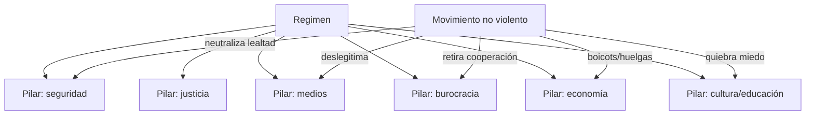

# DOCUMENTAL + FRAMEWORK — “Pilares de una Dictadura” vs “Estrategias de Revolución No Violenta” (v1.1)

> ✅ Con la pista nueva que diste (“pilares que legitiman dictaduras” + “antítesis ideológica en la mente” + ejemplos como protestar desde las casas/ventanas), el documental **más probable** ya no es *Starfish & Spider* como pieza principal, sino:
>
> **🎬 *How to Start a Revolution* (2011) — sobre Gene Sharp**
>
> Este documental (ganador BAFTA según programas culturales) se centra en las estrategias/tácticas de acción no violenta de Sharp, incluyendo su marco *From Dictatorship to Democracy* y el concepto de **“pillars of support” (pilares de apoyo)**. :contentReference[oaicite:0]{index=0}

---

## Tabla de contenido
1. Evidencia: qué documental es
2. El modelo mental: “el poder depende de apoyo”
3. Los “Pilares” de una dictadura (y cómo se erosionan)
4. Tácticas tipo “ventanas” (cacerolazos, ruido, símbolos): por qué funcionan
5. Las 3 familias de métodos (Gene Sharp) — mapa de tácticas
6. Dinámica: cómo progresa una revolución no violenta (por fases)
7. Cómo encaja *Starfish & Spider* con esto (tu cuaderno NO está “mal”; es otra capa)
8. Aplicación segura y bíblica a RFJ: revolución ideológica en pos de Cristo (sin violencia)
9. Cómo encontrar el fragmento exacto del video (sin adivinar)

---

## 1) Evidencia: qué documental es (por tu descripción)
**Tu descripción coincide con:**
- dictadura sostenida por **pilares de apoyo** (instituciones/sectores que “prestan” poder)
- estrategias para **retirar cooperación** (cambiar lealtades, romper miedo, deslegitimar)
- ejemplos modernos de protesta creativa (incl. acciones de bajo riesgo y alto símbolo)
- mención/uso de **198 métodos** (u “armas” no violentas) de Gene Sharp :contentReference[oaicite:1]{index=1}

👉 El documental *How to Start a Revolution* está descrito precisamente como una obra centrada en Sharp y sus marcos para enfrentar dictaduras mediante acción no violenta. :contentReference[oaicite:2]{index=2}

---

## 2) El modelo mental: “el poder depende de apoyo”
### Tesis central (ingeniería de poder)
Un régimen (incluso brutal) **no es “todopoderoso” por sí mismo**: es una máquina que funciona porque
miles/millones de personas e instituciones **cooperan** (por miedo, hábito, interés, ideología o inercia).

> **Dictadura = control + legitimidad + logística + obediencia**
>
> Si logras **cambiar la mente** (legitimidad) y **retirar cooperación** (obediencia/logística),
> la máquina pierde torque.

Esto se operacionaliza con el concepto:
**“Pillars of Support / Pillars of Power”** = instituciones/sectores que sostienen el régimen. :contentReference[oaicite:3]{index=3}

---

## 3) Los “Pilares” de una dictadura (y cómo se erosionan)
### 3.1 ¿Qué son los pilares?
**Pilares** = fuentes concretas de poder: instituciones, élites, sistemas, gremios, burocracia,
medios, fuerzas armadas, tribunales, educación, etc. :contentReference[oaicite:4]{index=4}

### 3.2 Ejemplos típicos de pilares (catálogo)
- Fuerzas armadas y policía
- Sistema judicial / fiscalías
- Medios (estatales, capturados o autocensurados)
- Educación (currículo, propaganda, control cultural)
- Iglesias / instituciones religiosas cooptadas (cuando legitiman al régimen)
- Funcionariado / burocracia (operación diaria del Estado)
- Empresariado aliado / monopolios / sindicatos capturados
- Plataformas financieras / control de pagos / permisos / licencias
- Redes de información/tecnología (vigilancia, censura, propaganda)

(La idea general de “pilares” como instituciones de soporte está documentada en recursos sobre Sharp). :contentReference[oaicite:5]{index=5}

### 3.3 Antítesis estratégica (lo que el documental enseña)
No se “derroga” una dictadura atacando solo al dictador.
Se la desarma **desacoplando** sus pilares:
- **Deslegitimación** (romper el hechizo moral/ideológico)
- **No cooperación** (retirar obediencia/servicios/participación)
- **Intervención no violenta** (crear hechos nuevos: alternativas, redes paralelas)

---

## 4) Tácticas tipo “ventanas”: por qué funcionan (la lógica del “ruido”)
Lo que describes (“protestar desde las casas por las ventanas”) se parece a:
- **cacerolazos** (ruido desde balcones/ventanas)
- aplausos coordinados, luces, pañuelos, señales visuales
- acciones sincronizadas con baja exposición física

### 4.1 ¿Por qué son potentes?
Porque atacan 4 variables a la vez:

1) **Rompen el miedo** (participación con riesgo bajo)
2) **Hacen visible la mayoría** (“no estoy solo”)
3) **Desgasta la propaganda** (“si todos están ahí, algo real pasa”)
4) **Construyen coordinación** (ensayan disciplina colectiva)

En el lenguaje de Sharp, esto suele caer en:
- *protesta y persuasión simbólica* (una de las familias de métodos). :contentReference[oaicite:6]{index=6}

> Metáfora: el régimen vive de “silencio + aislamiento”.
> El ruido desde ventanas es una **señal de red**: ping masivo que prueba que hay miles de nodos activos.

---

## 5) Las 3 familias de métodos (Gene Sharp) — mapa de tácticas
El marco de Sharp organiza los métodos en 3 grupos macro (y dentro de ellos aparecen sus listas extensas):
1) **Protesta y persuasión** (símbolos, marchas, arte, ruido, mensajes)
2) **No cooperación** (social, económica, política: boicots, huelgas, desobediencia)
3) **Intervención no violenta** (sentadas, ocupaciones, creación de alternativas, paralelos funcionales) :contentReference[oaicite:7]{index=7}

> Arquitectura de sistemas:
> - Protesta = señalización/telemetría pública
> - No cooperación = cortar combustible/logística
> - Intervención = construir un sistema alterno que ya opera

---

## 6) Dinámica: cómo progresa una revolución no violenta (por fases)
Una “revolución” (no violenta) suele pasar por fases:

### Fase 0 — Preparación (la guerra es ideológica)
- construir narrativa (verdad vs propaganda)
- entrenar disciplina (no violencia estratégica)
- mapear pilares (quién sostiene a quién)

### Fase 1 — Señal y cohesión
- acciones simbólicas (ventanas, ruido, signos)
- medir respuesta social y represión
- crear identidad común

### Fase 2 — Presión selectiva
- no cooperación escalonada (boicots/huelgas/paro sectorial)
- fisurar alianzas (pilares comienzan a dudar)

### Fase 3 — Ruptura de lealtades
- cuando pilares críticos cambian postura (o se neutralizan), el régimen pierde capacidad operativa

### Fase 4 — Transición
- alto riesgo de caos: se necesita estructura, acuerdos, y legitimidad alternativa

*(Esto es análisis conceptual de dinámica, no una instrucción para delinquir.)*

---

## 7) Cómo encaja *Starfish & Spider* con esto (tu cuaderno NO está “mal”)
Tus notas de *Starfish & Spider* son una **capa complementaria**:

- Sharp explica **cómo cae el poder** (retirar apoyo/pilares).
- Starfish explica **cómo se organiza y sobrevive el movimiento** (red descentralizada: círculos, catalizadores, ideología replicable).

De hecho, es coherente que tú hayas mezclado ambos materiales:
- *Starfish* = **topología** (P2P: círculos, catalizadores)
- *Sharp* = **estrategia de presión** (pilares, no cooperación, 198 métodos)

> Si tu meta es una “revolución ideológica”, Starfish es la *arquitectura* y Sharp es el *manual de dinámica de poder*.

---

## 8) Aplicación segura y bíblica a RFJ: revolución ideológica hacia Cristo (sin violencia)
### 8.1 “Pilares” (en clave cultural) que sostienen el trivialismo de lo eterno
Ejemplos (no personas: **sistemas de ideas/prácticas**):
- entretenimiento como anestesia moral
- relativismo como “religión civil”
- algoritmo como catequesis diaria
- vergüenza/culpa sin evangelio (captura emocional)
- iglesias sin Escritura (carisma sin Palabra)

### 8.2 Antítesis (evangelio como contra-ideología)
- Sola Scriptura: Palabra manda (no el trend)
- Solus Christus: centro único (no celebridad)
- Sola Gratia/Fide: salida real a culpa/obras
- Soli Deo Gloria: el fin último cambia todo

### 8.3 Tácticas “tipo ventanas” en RFJ (no políticas, sino espirituales)
- señales públicas pacíficas de fe y verdad (arte, testimonios, servicio visible)
- “acciones sincronizadas” de oración/ayuno/ayuda (alto símbolo, cero violencia)
- círculos de discipulado (Starfish) que multiplican sin culto al líder

> En RFJ, el “pilar” que buscamos debilitar no es gente: es la mentira.
> Y el “poder” que buscamos no es coerción: es convicción nacida de la verdad.

---

## 9) Cómo encontrar el fragmento exacto del video (sin adivinar)
Como ya hay:
- **la película en YouTube** :contentReference[oaicite:8]{index=8}
- **un transcript descargable** :contentReference[oaicite:9]{index=9}

Haz esto (rápido, determinista):
1) Abre el transcript (PDF) :contentReference[oaicite:10]{index=10}
2) Busca palabras clave:
   - `pillars` / `pillars of support`
   - `windows` / `pots` / `pans` / `noise`
   - `198 methods`
3) Con el minuto/segmento, vuelves al video y confirmas.

Si me dices **2–3 palabras exactas** que recuerdes del narrador (en inglés),
yo te armo un set de búsquedas “quirúrgicas” para YouTube que casi siempre lo clavan en 1–3 intentos.

---

## Mini-diagrama (memoria visual)

