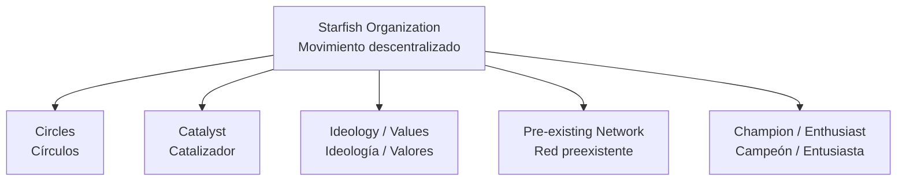
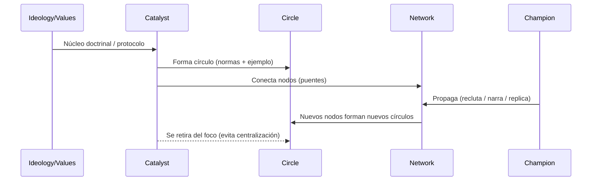
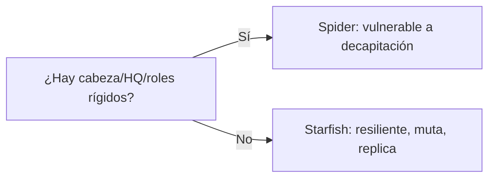

RFJ — Teoría de Revoluciones Descentralizadas (Starfish)

Documento maestro (v1) — reconstruido desde tus notas/fotos (2015) + trazas del material original en inglés

Tabla de contenido

Qué estamos intentando lograr

Hallazgo clave: “el documental” casi seguro es The Starfish and the Spider

Candidatos más probables del video original (en inglés)

Cómo “clavar” el video exacto en YouTube (procedimiento de rastreo)
# RFJ — Teoría de Revoluciones Descentralizadas (Starfish)

Documento maestro (v1) — reconstruido desde tus notas/fotos (2015) + trazas del material original en inglés

## Tabla de contenido

- Qué estamos intentando lograr
- Hallazgo clave: “el documental” casi seguro es *The Starfish and the Spider*
- Candidatos más probables del video original (en inglés)
- Cómo “clavar” el video exacto en YouTube (procedimiento de rastreo)
- Modelo núcleo: Araña vs Estrella de Mar
- Los 5 “legs” de una Starfish Organization (tu cuaderno + fuente)
- Principios/Reglas que aparecen en tu material
- Unidad mínima viable: el Círculo
- Roles: Catalizador vs Entusiasta/Campeón
- Pegamento social: por qué la gente entra y se queda
- Checklist diagnóstico: ¿Starfish u Spider? (tu encuesta)
- Leyes duras / Axiomas (tus “warning labels”)
- Híbridos: cuando conviene mezclar Spider+Starfish
- Aplicación a “Revolution for Jesus” (RFJ) — enfoque bíblico y no violento
- Observaciones de “review” (mejoras a tus notas y a la implementación)
- Diagramas (Mermaid) para visualizar el sistema
- Referencias rastreables (para volver al origen)

---

## Qué estamos intentando lograr

### Resultado exitoso (v1)

1. Encontrar el video (en inglés) del que nacieron tus notas 2015 (YouTube).
2. Extraer y formalizar la teoría/patrones: cómo “prende” una revolución por descentralización + ideología replicable + círculos (sin depender de líderes-cabeza).

## Hallazgo clave

El documental casi seguro es *The Starfish and the Spider* (The Unstoppable Power of Leaderless Organizations — Ori Brafman & Rod Beckstrom).

En tu hoja aparecen conceptos canónicos: *circles*, *catalyst*, *ideology*, *champions/enthusiasts*, *pre-existing network* y diagnóstico sobre cabeza/HQ.

## Hipótesis operativa (v1)

Tu “documental” fue: (a) una charla/ponencia de Ori Brafman o Rod Beckstrom, o (b) un video-resumen muy fiel al libro. Si no, como plan B podría ser *How to Start a Revolution* (Gene Sharp).

## Candidatos más probables del video original (en inglés)

**A)** Charla/ponencia de Ori Brafman (“Starfish Organizations / Decentralized Movements”)

**B)** *The Starfish and the Spider* — Talks at Google (Rod Beckstrom)

**C)** *5 Keys to Decentralized Movements (from The Starfish & The Spider)* (video corto)

**D)** *How to Start a Revolution* (Gene Sharp) — Plan B si mezcla memoria con teoría de acción no violenta.

## Cómo “clavar” el video exacto en YouTube (procedimiento de rastreo)

### Paso 1 — Buscar por frases “ancla” (entre comillas)

Pruebas de búsqueda (literal):

"Starfish organizations" "unstoppable power" Ori Brafman

"The Starfish and the Spider" Talks at Google

"Catalysts rule" starfish

"The values are the organization" starfish

"pre-existing network" "circle" catalyst ideology champion

> Regla: el video correcto tendrá varias de esas frases en el mismo discurso.

### Paso 2 — Verificación rápida (checklist de 30 segundos)

El video es el correcto si en los primeros minutos:

- Explica *spider* vs *starfish* (decapitación vs regeneración).
- Nombra *circles* y *catalysts*.
- Insiste en *ideology/values* como “combustible”.
- Habla de *network effect* y crecimiento por nodos.

### Paso 3 — Señales “forenses” que amarran con tu cuaderno (2015)

En tus notas aparecen frases como:

- “Catalyst … conecta y luego desaparece del foco”
- “Values/ideology = la organización”
- “Measure, monitor, manage (mirando círculos, salud de red)”
- “Flatten or be flattened / híbridos”

## Modelo núcleo: Araña vs Estrella de mar

### Spider Organization (centralizada)

- Tiene cabeza (control/decisión).
- Jerarquía, HQ, roles fijos.
- Single Point of Failure: decapitas liderazgo ⇒ colapsa.

### Starfish Organization (descentralizada)

- No hay cabeza; la inteligencia es distribuida.
- Cortas un brazo ⇒ se regenera; incluso se multiplica.
- Autonomía local + coherencia global por ideología/valores.

## Los 5 “legs” de una Starfish Organization

1. Circles (Círculos)
2. Catalyst (Catalizador)
3. Ideology (Ideología/Valores)
4. Pre-existing network (Red preexistente)
5. Champion (Campeón/Entusiasta)

## Principios/Reglas (extraídas de tu material)

- *Catalysts rule*: el catalizador inspira, conecta y sabe soltar.
- *The values are the organization*: la ideología es motor y estándar.
- *Network effect*: cada miembro añade valor a la red.
- *Open systems mutate*: sistemas abiertos mutan y crecen.
- *Measure / monitor / manage*: mirar la salud de los círculos.

## Unidad mínima viable: el Círculo

Definición (v1):

Un círculo nace cuando un catalizador predica/encarna una idea con normas replicables; la comparte, cuida a otros y la vuelve reproducible.

Analogía software:

- Ideología = protocolo (RFC) + contrato + definición de “correcto”.
- Círculo = instancia que corre ese protocolo.
- Catalizador = *bootstrap node*.
- Red = topología P2P.

## Roles: Catalizador vs Entusiasta/Campeón

**Catalizador**

- Inicia el círculo, conecta redes y protege coherencia sin centralizar. Se retira del foco a tiempo.

**Entusiasta / Campeón**

- Propaga la idea, la vuelve contagiosa y recluta nuevos nodos.

## Pegamento social: por qué la gente entra y se queda

- Comunidad, sentido, pasos graduales, libertad, relaciones y doctrina/ideología rigurosa.
- Motivación intrínseca, control cultural (normas) y escala por confianza.

## Checklist diagnóstico: ¿Starfish u Spider?

Preguntas clave (v1):

- ¿Hay una persona “a cargo”? (Si sí → Spider)
- ¿Hay HQ/oficinas centrales?
- Si “cortas la cabeza”, ¿muere?
- ¿División rígida de roles?
- ¿Poder y conocimiento concentrados o distribuidos?
- ¿Es flexible o rígida?

## Leyes duras / Axiomas

- “La única forma de destruir un sistema descentralizado es destruir su ideología.”
- Propiedad/exclusividad tiende a crear centro y jerarquía.
- “El mayor oponente de una estrella de mar es otra estrella de mar.”

## Híbridos: cuando conviene mezclar Spider+Starfish

Un híbrido sirve cuando necesitas cumplimiento, seguridad, finanzas o trazabilidad (zonas Spider), y quieres escala y resiliencia (zonas Starfish).

## Conclusiones destiladas

- Muchos pequeños organizados > uno grande.
- Círculos = incendiadores de cambio.
- El catalizador conecta y habilita; no centraliza.
- Los valores/ideología son el núcleo operativo.

## Aplicación a “Revolution for Jesus” (RFJ)

Marco ético (v1): reforma cultural/espiritual por persuasión, discipulado, servicio y fidelidad bíblica; no coerción.

Traducción a RFJ:

- Ideología/Valores: Biblia como autoridad; doctrina = protocolo común.
- Círculos: células de discipulado, estudio, oración y servicio.
- Catalizadores: conectan, forman y se quitan del foco.
- Red preexistente: familias, iglesias, barrios y redes digitales.

### Antipatrones RFJ

- Catalizador que se vuelve cabeza permanente.
- Propiedad/estatus que crea jerarquía.
- Sustituir Escritura por carisma o estética.

### Métricas esenciales (RFJ)

- Salud de círculos (actividad, fidelidad, multiplicación).
- Densidad de conexiones.
- Capacidad de mutación sin traicionar núcleo.

## Observaciones de “review” (mejoras sugeridas)

- Definir ideología con precisión bíblica (núcleo vs prácticas adaptables).
- Distinguir descentralización de anarquía.
- Formalizar el “contrato del círculo” (enseñanza, corrección, cuidado, multiplicación).
- Diseñar mecanismos anti-araña: rotación, rendición de cuentas, transparencia.

## Diagramas (Mermaid) para visualizar el sistema

1) Los 5 legs (arquitectura mínima)

2) Ciclo de propagación (cómo “prende” una revolución)

3) Test Starfish vs Spider (punto de falla)

## Referencias rastreables (para volver al origen)

Fuentes que coinciden con tus notas:

- PDF (2015): resumen del libro y notas de un talk de Ori Brafman.
- Referencia a *Talks at Google* (Rod Beckstrom).
- Video corto de “5 Keys”.
- PDF-resumen: https://simplechurch.eu/wp-content/uploads/2015/05/the_starfish_and_the_spider.pdf
- Plan B (Gene Sharp): buscar *How to Start a Revolution* (2011).

---

### Apéndice — Links (targets sugeridos)

- Talks at Google: buscar "The Starfish and the Spider Talks at Google Rod Beckstrom"
- Ori Brafman talks: buscar "Ori Brafman Starfish Networks Agile Leaders"
- Video corto: https://www.youtube.com/watch?v=N23Lm3TW2OM
- PDF-resumen: https://simplechurch.eu/wp-content/uploads/2015/05/the_starfish_and_the_spider.pdf
- Gene Sharp (plan B): buscar "How to Start a Revolution 2011 Gene Sharp trailer"
