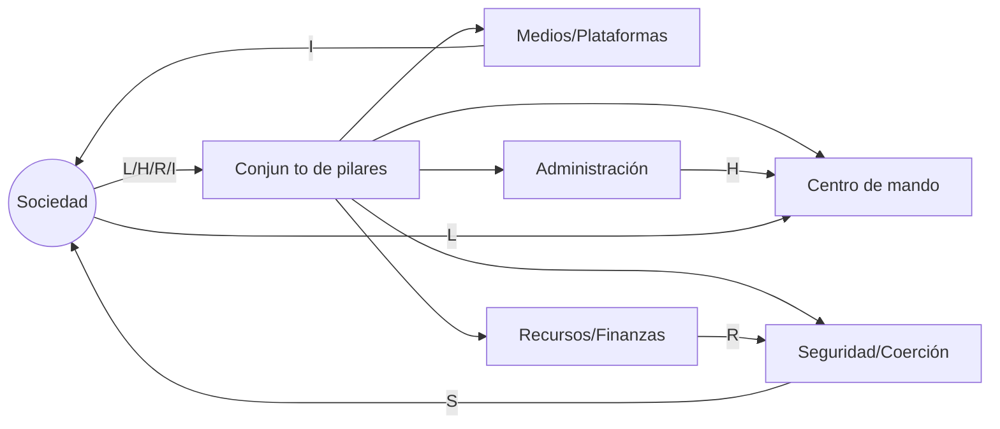

# Resumen con OCR: 00 - Teoria Definitiva de Como Crear una Revolucion Ideologica

**Fuente original:** De la dictadura a la democracia (Gene Sharp) .md

**Ubicación:** 00_docs_base\00 - Teoria Definitiva de Como Crear una Revolucion Ideologica

**Nota:** Texto extraído mediante OCR (puede contener errores de reconocimiento)

## Resumen breve

**Arquitectura del poder: fuentes, pilares y legitimidad**
4.

### X.2 Grafo de Dependencias del Poder (GDP)
- Nodos: pilares (medios, fuerzas, burocracia, universidades, iglesias, finanzas, etc.).



### X.3 DSL de campañas (plantilla)
- Una campaña es un programa compuesto por: meta medible, pilares objetivo, hipótesis causal, fases, señales y salida.

#### Tipos de dependencia (etiquetas recomendadas)
- `L` = Legitimidad (prestigio, autoridad moral, narrativa)
- `R` = Recursos (finanzas, acceso, infraestructura)
- `H` = Humanos (personal, experticia, burocracia)
- `I` = Información (medios, propaganda, datos, educación)
- `S` = Sanción (capacidad de castigo/coerción; se modela como “capacidad” que también depende de humanos/legitimidad/recursos)

### X.2.2 Representación visual (plantilla)
```mermaid
flowchart LR
Pueblo((Sociedad)) -->|L/H/R/I| Pilares[Conjunto de pilares]
Pilares --> Estado[Centro de mando]
Pilares --> Medios[Medios/Plataformas]
Pilares --> Economia[Recursos/Finanzas]
Pilares --> Buro[Administración]
Pilares --> Fuerza[Seguridad/Coerción]
Medios -->|I| Pueblo
Economia -->|R| Fuerza
Buro -->|H| Estado
Fuerza -->|S| Pueblo
Pueblo -->|L| Estado


Lectura: la coerción (S) no es independiente: bebe de R y L.

## Resumen detallado

**Resumen ejecutivo**
2.

**La tesis madre de Sharp: el poder es relacional**
3.

**Arquitectura del poder: fuentes, pilares y legitimidad**
4.

---

# 2) La tesis madre de Sharp: el poder es relacional
## 2.1 El poder no “habita” en el dictador
- No es una sustancia que alguien “posee” para siempre.

- **Infraestructura:** instituciones, burocracia, finanzas, medios, fuerzas armadas.

---

# 4) No violencia como tecnología social
## 4.1 No violencia ≠ pasividad
- Es **conflicto** sin destrucción física.

### X.2 Grafo de Dependencias del Poder (GDP)
- Nodos: pilares (medios, fuerzas, burocracia, universidades, iglesias, finanzas, etc.).

```mermaid
flowchart LR
  Pueblo((Sociedad)) -->|L/H/R/I| Pilares[Conjunto de pilares]
  Pilares --> Estado[Centro de mando]
  Pilares --> Medios[Medios/Plataformas]
  Pilares --> Economia[Recursos/Finanzas]
  Pilares --> Buro[Administración]
  Pilares --> Fuerza[Seguridad/Coerción]
  Medios -->|I| Pueblo
  Economia -->|R| Fuerza
  Buro -->|H| Estado
  Fuerza -->|S| Pueblo
  Pueblo -->|L| Estado
```

### X.3 DSL de campañas (plantilla)
- Una campaña es un programa compuesto por: meta medible, pilares objetivo, hipótesis causal, fases, señales y salida.

Ejemplo (YAML):
```yaml
campaña:
  nombre: "PENDIENTE"
  meta:
    problema: "PENDIENTE"
    objetivo_medible: "PENDIENTE"
  pilares_objetivo:
    - pilar: "Medios"
      dependencias_clave: ["I","L"]
  hipotesis_causal: "Si...

#### Tipos de dependencia (etiquetas recomendadas)
- `L` = Legitimidad (prestigio, autoridad moral, narrativa)
- `R` = Recursos (finanzas, acceso, infraestructura)
- `H` = Humanos (personal, experticia, burocracia)
- `I` = Información (medios, propaganda, datos, educación)
- `S` = Sanción (capacidad de castigo/coerción; se modela como “capacidad” que también depende de humanos/legitimidad/recursos)

### X.2.2 Representación visual (plantilla)
```mermaid
flowchart LR
Pueblo((Sociedad)) -->|L/H/R/I| Pilares[Conjunto de pilares]
Pilares --> Estado[Centro de mando]
Pilares --> Medios[Medios/Plataformas]
Pilares --> Economia[Recursos/Finanzas]
Pilares --> Buro[Administración]
Pilares --> Fuerza[Seguridad/Coerción]
Medios -->|I| Pueblo
Economia -->|R| Fuerza
Buro -->|H| Estado
Fuerza -->|S| Pueblo
Pueblo -->|L| Estado


Añadiría una pieza “imposible de ignorar” por su ingenio: convertir todo Sharp en un modelo formal tipo ingeniería de sistemas, como si una revolución fuera un software que se compila, se prueba y se despliega con restricciones éticas.

---

## X.2 Modelo 1: Grafo de Dependencias del Poder (GDP)
### X.2.1 Definición
Representa el poder como un **grafo dirigido y ponderado**:

- **Nodos (V):** pilares e infraestructuras (instituciones, élites simbólicas, burocracias, plataformas, gremios, fuerzas del orden, medios, universidades, etc.).

#### Tipos de dependencia (etiquetas recomendadas)
- `L` = Legitimidad (prestigio, autoridad moral, narrativa)
- `R` = Recursos (finanzas, acceso, infraestructura)
- `H` = Humanos (personal, experticia, burocracia)
- `I` = Información (medios, propaganda, datos, educación)
- `S` = Sanción (capacidad de castigo/coerción; se modela como “capacidad” que también depende de humanos/legitimidad/recursos)

### X.2.2 Representación visual (plantilla)
```mermaid
flowchart LR
Pueblo((Sociedad)) -->|L/H/R/I| Pilares[Conjunto de pilares]
Pilares --> Estado[Centro de mando]
Pilares --> Medios[Medios/Plataformas]
Pilares --> Economia[Recursos/Finanzas]
Pilares --> Buro[Administración]
Pilares --> Fuerza[Seguridad/Coerción]
Medios -->|I| Pueblo
Economia -->|R| Fuerza
Buro -->|H| Estado
Fuerza -->|S| Pueblo
Pueblo -->|L| Estado


Lectura: la coerción (S) no es independiente: bebe de R y L.

¿La narrativa es verificable (no propaganda)?

X.8.2 Contribución original del anexo

Formaliza Sharp como modelo de red (GDP).

X.9 Mini-plantillas para usar en tu ponencia (copiar/pegar)
X.9.1 One-pager de campaña (para diapositiva)

Meta (1 línea): …

Pilares (3 bullets): …

Hipótesis causal: …

Fases (3 pasos): …

Métricas (3 números): …

Riesgos y mitigación: …

Salida (día después): …

X.9.2 Mapa rápido de pilares (matriz 2×2)

Impacto sistémico: Alto/Bajo

Costo social: Alto/Bajo
Prioriza: Alto impacto + Bajo costo.

X.10 Cierre para el auditorio (frase final)

“Una revolución no violenta no es una explosión; es una compilación.

## Conceptos clave

- **pilares**: (revisar y definir rol en el documento)

- **es**: (revisar y definir rol en el documento)

- **x**: (revisar y definir rol en el documento)

- **2**: (revisar y definir rol en el documento)

- **1**: (revisar y definir rol en el documento)

- **medios**: (revisar y definir rol en el documento)

- **legitimidad**: (revisar y definir rol en el documento)

- **poder**: (revisar y definir rol en el documento)

## Índice sugerido

1. ---

2. 1. **Resumen ejecutivo**

3. 2. **La tesis madre de Sharp: el poder es relacional**

4. 3. **Arquitectura del poder: fuentes, pilares y legitimidad**

5. 4. **No violencia como tecnología social (no como romanticismo)**

6. 5. **El “arsenal” de acción: 3 familias (y para qué sirve cada una)**

7. 6. **Estrategia vs. táctica: cómo se piensa una revolución**

8. 7. **Preparación: el “laboratorio oculto” antes de la calle**

9. 8. **Diseño de campañas: objetivos, secuencias, escalamiento**

10. 9. **Gestión de represión: el judo político y el efecto búmeran**

11. 10. **Fractura y realineamiento: cómo cambian las lealtades**

12. 11. **Negociación y transición: ganar no es gobernar**

## Temas y palabras clave

pilares, es, x, 2, 1, medios, legitimidad, poder, social, pendiente, 3, revolución, si, pueblo, sharp, violencia, recursos, dependencias

## Prompts recomendados para IA

- Revisa y mejora este resumen extraído por OCR.
- Extrae 10 preguntas clave sobre el documento.
- Genera un índice estructurado con secciones.
