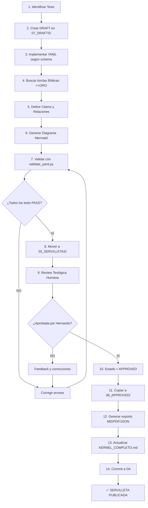

# 🏗️ ARQUITECTURA KERNEL DOCTRINAL RFJ 2026

**Versión:** 1.0.0  
**Fecha:** 2026-02-22  
**Propósito:** Documentar la arquitectura completa del sistema de servilletas doctrinales

---

## 📋 TABLA DE CONTENIDOS

1. [Visión General](#vision-general)
2. [Estructura de Carpetas](#estructura-de-carpetas)
3. [Flujo de Trabajo](#flujo-de-trabajo)
4. [Componentes del Sistema](#componentes-del-sistema)
5. [Decisiones Arquitectónicas](#decisiones-arquitectonicas)
6. [Escalabilidad](#escalabilidad)
7. [Validación y QA](#validacion-y-qa)
8. [Stack Tecnológico](#stack-tecnologico)

---

## 1. VISIÓN GENERAL {#vision-general}

### 1.1 Propósito del Sistema

El **KERNEL_DOCTRINAL** es un sistema de gestión de conocimiento teológico que:

- Define verdades bíblicas como **módulos atómicos** (servilletas)
- Garantiza **trazabilidad total** a la Escritura
- Valida **convergencia teológica** entre tradiciones sanas
- Genera **outputs consumibles** por humanos y agentes IA
- Escala de **S001 a S099** sin contradicciones

### 1.2 Metáforas Arquitectónicas

| Metáfora | Significado |
|----------|-------------|
| **Kernel de Sistema Operativo** | Servilletas S001-S020 son funciones core que nunca cambian |
| **Código Fuente** | Archivos YAML son "source code" de la doctrina |
| **Compilador** | Scripts de validación garantizan integridad |
| **Tests Unitarios** | Cada servilleta tiene tests automáticos |
| **Grafo de Dependencias** | Relaciones entre claims forman un DAG (Directed Acyclic Graph) |

### 1.3 Principios Rectores

1. **Inmutabilidad teológica:** Kernel (S001-S020) es convergencia máxima, no cambia
2. **Atomicidad:** Una servilleta = una verdad indivisible
3. **Composabilidad:** Servilletas se combinan sin contradicciones
4. **Verificabilidad:** Toda proposición tiene >=2 anclas bíblicas
5. **Escalabilidad:** Sistema soporta 99+ servilletas sin colapsar

---

## 2. ESTRUCTURA DE CARPETAS {#estructura-de-carpetas}

```
kernel/
│
├── config/                          # ⚙️ Configuración del sistema
│   └── config.yaml                  # Settings: paths, validación, exports
│
├── docs/                            # 📚 Documentación maestra
│   ├── METODOLOGIA.md               # Método para crear servilletas
│   ├── ARQUITECTURA.md              # Este documento
│   ├── ROADMAP.md                   # Plan S001-S099
│   ├── DECISIONES.md                # Log de decisiones teológicas
│   └── CHANGELOG.md                 # Historial de cambios
│
├── schemas/                         # 🔧 Validación estructural
│   └── servilleta.schema.json       # Schema JSON principal
│
├── servilletas/                     # 🔴 NÚCLEO - Archivos YAML
│   │
│   ├── 00_kernel/                   # S001-S020 (80-100% convergencia)
│   │   ├── S001_Atributos_Dios.yaml
│   │   ├── S002_Trinidad.yaml
│   │   ├── S003_Santidad_Justicia.yaml
│   │   └── [...hasta S020]
│   │
│   ├── 01_layer/                    # S021-S070 (50-79% convergencia)
│   │   ├── S021_Bautismo_Agua.yaml
│   │   └── [...hasta S070]
│   │
│   └── 02_periphery/                # S071-S099 (<50% convergencia)
│       ├── S071_Milenio.yaml
│       └── [...hasta S099]
│
├── tools/                           # 🛠️ Scripts organizados por función
│   ├── validate/                    # Validadores
│   │   ├── validate_yaml.py         # Validador completo
│   │   ├── batch_validate.py        # Validar todas
│   │   └── check_convergencia.py    # Verifica convergencia
│   │
│   ├── generate/                    # Generadores
│   │   ├── mermaid_generator.py     # Generador de diagramas
│   │   └── master_doc_generator.py  # Docs consolidados
│   │
│   ├── export/                      # Exportadores
│   │   ├── markdown_exporter.py     # YAML → MD
│   │   ├── pdf_exporter.py          # MD → PDF
│   │   └── json_exporter.py         # YAML → JSON
│   │
│   ├── analyze/                     # Analizadores
│   │   ├── coverage_analyzer.py     # Cobertura bíblica
│   │   └── dependency_checker.py    # Grafo de dependencias
│   │
│   └── utils/                       # Utilidades compartidas
│       ├── bible_parser.py          # Parser de referencias
│       ├── tier_calculator.py       # Calcula tier automático
│       └── convergence_scorer.py    # Score de convergencia
│
├── outputs/                         # 📦 Contenido generado
│   ├── diagrams/                    # 📊 Visualizaciones
│   │   ├── mermaid/                 # Código Mermaid (.mmd)
│   │   ├── svg/                     # Diagramas vectoriales
│   │   └── png/                     # Diagramas raster
│   │
│   ├── exports/                     # Salidas consumibles
│   │   ├── markdown/                # Para humanos
│   │   ├── pdf/                     # Para impresión
│   │   └── json/                    # Para APIs/IAs
│   │
│   └── master/                      # Documentos consolidados
│       ├── KERNEL_COMPLETO.md
│       └── DEPENDENCIAS_GRAPH.svg
│
├── tests/                           # ✅ Validación automática
│   ├── test_estructura.py
│   ├── test_convergencia.py
│   ├── test_trazabilidad.py
│   ├── test_dependencias.py
│   ├── fixtures/                    # Casos de prueba
│   └── results/                     # Reportes HTML
│
└── workspace/                       # 📝 Área temporal
    ├── drafts/                      # Servilletas en construcción
    │   ├── S00X_Nombre_DRAFT.yaml
    │   └── notes/                   # Notas de desarrollo
    │
    └── archive/                     # Versiones antiguas/deprecated
        └── [Servilletas reemplazadas]
```

---

## 3. FLUJO DE TRABAJO {#flujo-de-trabajo}

### 3.1 Pipeline Completo (Desarrollo → Producción)



### 3.2 Estados de una Servilleta

| Estado | Ubicación | Significado | Acción siguiente |
|--------|-----------|-------------|------------------|
| **DRAFT** | `07_DRAFTS/` | Trabajo inicial | Implementar estructura |
| **WIP** | `07_DRAFTS/` | En construcción | Completar anclas |
| **REVIEW** | `03_SERVILLETAS/` | Lista para revisión | Review teológica |
| **APPROVED** | `08_APPROVED/` | Aprobada | Generar exports |
| **PUBLISHED** | `05_EXPORTS/` | Disponible | Usar en producción |
| **DEPRECATED** | `09_DEPRECATED/` | Obsoleta | Migrar a nueva versión |

---

## 4. COMPONENTES DEL SISTEMA {#componentes-del-sistema}

### 4.1 Servilletas (YAML)

**Anatomía de una servilleta:**

```yaml
metadata:
  id: S001
  titulo: "..."
  tesis: "..."                    # 1 línea, <300 caracteres
  tier: KERNEL_PURO               # Nivel de convergencia
  convergencia_score: 100         # 0-100
  trazabilidad_nivel: DIAMANTE    # BRONCE/PLATA/ORO/DIAMANTE

claims:                           # 3-10 proposiciones atómicas
  C1_NOMBRE:
    text: "..."
    anclas_biblicas: [...]        # >=2 versículos
    peso_generativo: 1-10

relaciones:                       # Conexiones entre claims
  - from: C1
    to: C2
    type: FUNDAMENTA              # 7 tipos válidos
    fuerza: 1-10

guardarrailes:                    # Herejías refutadas
  G1_NOMBRE:
    error: "..."
    refutado_por: [C1, C2]

tests:                            # Validación automática
  T1_NOMBRE:
    status: PASS | FAIL

diagrama_mermaid: |               # Visualización
  graph TD
    C1 --> C2
```

### 4.2 Scripts de Validación

**Validaciones automáticas:**

1. **Estructura YAML válida:** `validate_yaml.py`
2. **Trazabilidad suficiente:** ¿Cumple nivel ORO mínimo?
3. **Convergencia correcta:** ¿Tier coincide con score?
4. **Referencias bíblicas:** ¿Formato correcto? ¿Existen?
5. **Dependencias resueltas:** ¿Claims referenciados existen?
6. **Diagrama válido:** ¿<=9 nodos, <=4 niveles?
7. **No hay ciclos:** ¿Grafo es acíclico?

### 4.3 Exports (Outputs Consumibles)

**Formatos generados:**

- **Markdown (.md):** Para GitHub, Notion, documentación
- **PDF (.pdf):** Para impresión, estudio offline
- **JSON (.json):** Para APIs, agentes IA, integraciones
- **SVG (.svg):** Diagramas vectoriales editables
- **PNG (.png):** Diagramas raster para presentaciones

---

## 5. DECISIONES ARQUITECTÓNICAS {#decisiones-arquitectonicas}

### 5.1 ¿Por qué YAML y no JSON/XML/MD?

| Criterio | YAML | JSON | XML | Markdown |
|----------|------|------|-----|----------|
| Legible por humanos | ✅ | ⚠️ | ❌ | ✅ |
| Estructura rígida | ✅ | ✅ | ✅ | ❌ |
| Comentarios | ✅ | ❌ | ⚠️ | ✅ |
| Multi-línea nativo | ✅ | ❌ | ⚠️ | ✅ |
| Schema validation | ✅ | ✅ | ✅ | ❌ |
| Parsers disponibles | ✅ | ✅ | ✅ | ⚠️ |

**Decisión:** YAML porque combina estructura rígida con legibilidad humana.

### 5.2 ¿Por qué separar por tier (Kernel/Capa/Periferia)?

**Razones:**

1. **Gestión de cambios:** Kernel nunca cambia, periferia puede evolucionar
2. **Convergencia clara:** Tier físico = compromiso teológico
3. **Onboarding:** Nuevos usuarios empiezan por Kernel (certezas máximas)
4. **Filtrado:** APIs pueden servir solo "tier >= KERNEL"

### 5.3 ¿Por qué validación automática?

**Sin validación automática:**
- ❌ Herejías pueden colarse
- ❌ Referencias bíblicas erróneas
- ❌ Grafos con ciclos (contradicciones lógicas)
- ❌ Claims sin anclas (alucinaciones)

**Con validación automática:**
- ✅ Integridad garantizada
- ✅ CI/CD posible (GitHub Actions)
- ✅ Agentes IA con guardarraíles

### 5.4 ¿Por qué grafo de dependencias?

**Beneficios:**

1. **Orden de construcción:** Saber qué hacer primero
2. **Impacto de cambios:** Si S003 cambia, ¿qué servilletas se afectan?
3. **Visualización:** Ver "mapa de la doctrina" completo
4. **Detección de ciclos:** Evitar contradicciones lógicas

---

## 6. ESCALABILIDAD {#escalabilidad}

### 6.1 Límites del Sistema

| Límite | Valor | Razón |
|--------|-------|-------|
| **Servilletas totales** | 99 | Suficiente para doctrina esencial |
| **Claims por servilleta** | 3-10 | Atomicidad (Ley de Miller 7±2) |
| **Anclas por claim** | 2-20 | Mínimo 2, máximo razonable 20 |
| **Nodos en diagrama** | ≤9 | Comprensibilidad visual |
| **Niveles en diagrama** | ≤4 | Evitar complejidad |
| **Relaciones por nodo** | ≤3 | Claridad visual |

### 6.2 ¿Qué pasa si necesitamos S100, S101...?

**Opciones:**

1. **Fusionar servilletas:** Algunas de PERIFERIA pueden consolidarse
2. **Crear sub-servilletas:** S014a, S014b (variantes)
3. **Namespaces:** S_SOTERIOLOGIA_001, S_PNEUMATOLOGIA_001
4. **Versión 2.0:** Kernel_v2 con nueva arquitectura

**Decisión actual:** 99 servilletas son suficientes. Si llegamos ahí, es victoria total.

### 6.3 Rendimiento

**Estimaciones:**

- **Tiempo de validación:** ~200ms por servilleta
- **Validación completa (99 servilletas):** ~20 segundos
- **Generación de exports:** ~5 segundos por servilleta
- **Generación de KERNEL_COMPLETO.md:** ~10 segundos

**Optimizaciones:**
- Cachear resultados de validación
- Paralelizar validaciones (pytest-xdist)
- Validar solo servilletas modificadas (Git diff)

---

## 7. VALIDACIÓN Y QA {#validacion-y-qa}

### 7.1 Niveles de Validación

**NIVEL 1: Estructura (Automática)**
- YAML parseable sin errores
- Campos obligatorios presentes
- Tipos de datos correctos
- IDs únicos

**NIVEL 2: Integridad (Automática)**
- Trazabilidad suficiente (>=ORO para Kernel)
- Convergencia coincide con tier
- Referencias bíblicas válidas
- No hay dependencias circulares

**NIVEL 3: Teología (Manual)**
- Convergencia real (verificar fuentes)
- Anclas en contexto correcto
- No hay herejías sutiles
- Claridad doctrinal

**NIVEL 4: Aprobación Final (Hernando)**
- Decisión final sobre aceptación
- Alineación con visión RFJ
- Utilidad práctica

### 7.2 Tests Automáticos

**Tests por servilleta:**

```python
def test_S001_estructura():
    """Verifica estructura YAML válida"""
    assert yaml.safe_load(S001) is not None

def test_S001_trazabilidad():
    """Verifica trazabilidad ORO (>=10 versículos)"""
    assert len(S001.anclas_biblicas) >= 10

def test_S001_convergencia():
    """Verifica convergencia 100% (KERNEL_PURO)"""
    assert S001.convergencia_score == 100

def test_S001_dependencias():
    """Verifica que claims referenciados existen"""
    for rel in S001.relaciones:
        assert rel.from in S001.claims
        assert rel.to in S001.claims

def test_S001_diagrama():
    """Verifica diagrama tiene <=9 nodos"""
    nodos = extract_nodes(S001.diagrama_mermaid)
    assert len(nodos) <= 9
```

---

## 8. STACK TECNOLÓGICO {#stack-tecnologico}

### 8.1 Lenguajes y Formatos

| Componente | Tecnología | Razón |
|------------|------------|-------|
| **Servilletas** | YAML | Legible + estructurado |
| **Validación** | Python 3.11+ | Ecosistema maduro |
| **Diagramas** | Mermaid | Código → SVG |
| **Exports** | Pandoc | MD → PDF/DOCX |
| **Tests** | pytest | Standard Python testing |
| **Schema** | JSON Schema | Validación robusta |

### 8.2 Dependencias Python

```txt
# requirements.txt
pyyaml>=6.0
jsonschema>=4.17
pytest>=7.3
requests>=2.31          # Para Bible API
mermaid-py>=0.4         # Generación Mermaid
pandoc>=2.3             # MD → PDF
click>=8.1              # CLI
rich>=13.0              # Terminal UI bonito
```

### 8.3 Herramientas Opcionales

- **GitHub Actions:** CI/CD automático
- **Pre-commit hooks:** Validar antes de commit
- **VSCode Extension:** Syntax highlighting para servilletas
- **Notion Integration:** Exportar a base de datos Notion
- **Obsidian Plugin:** Visualizar grafo en Obsidian

---

## 9. ROADMAP TÉCNICO

### 9.1 Fase 0: Fundamentos (HOY 22-Feb-2026)

- [x] Crear estructura de carpetas
- [x] Copiar archivos de Insumos2
- [x] Persistir ARQUITECTURA.md
- [ ] Crear config.yaml
- [ ] Crear .gitignore
- [ ] Crear README.md principal

### 9.2 Fase 1: Herramientas Base (23-Feb-2026)

- [ ] Ajustar validate_yaml.py para nueva estructura
- [ ] Crear generate_mermaid.py
- [ ] Crear export_to_markdown.py
- [ ] Crear batch_validate.py
- [ ] Ejecutar primera validación de S001

### 9.3 Fase 2: Primeras 5 Servilletas (24-28 Feb)

- [ ] S002 Trinidad (CRÍTICA)
- [ ] S003 Santidad y Justicia (CRÍTICA)
- [ ] S004 Amor y Misericordia
- [ ] S005 Soberanía y Providencia

### 9.4 Fase 3: Kernel Completo (Mar 2026)

- [ ] S006-S020 (15 servilletas restantes del kernel)
- [ ] Validación total del kernel
- [ ] Generar KERNEL_COMPLETO.md
- [ ] Generar DEPENDENCIAS_GRAPH.svg

### 9.5 Fase 4: Capa y Periferia (Q2 2026)

- [ ] S021-S070 (Capa)
- [ ] S071-S099 (Periferia)
- [ ] Dashboard de métricas
- [ ] Documentación API

---

## 10. MÉTRICAS DE ÉXITO

### 10.1 KPIs del Sistema

**Completitud:**
- [ ] 20/20 servilletas Kernel completadas (0% → 100%)
- [ ] 50/50 servilletas Capa completadas
- [ ] 29/29 servilletas Periferia completadas

**Calidad:**
- [ ] 100% de servilletas pasan validación automática
- [ ] 0 herejías detectadas en review teológica
- [ ] >=10 versículos únicos por servilleta (promedio)

**Cobertura Bíblica:**
- [ ] 39/39 libros AT representados (100%)
- [ ] 27/27 libros NT representados (100%)
- [ ] >=500 versículos únicos totales

**Convergencia:**
- [ ] Kernel: 100% convergencia entre tradiciones sanas
- [ ] Capa: >=50% convergencia
- [ ] Periferia: Divergencias documentadas honestamente

### 10.2 Dashboard Actual

```
╔══════════════════════════════════════════════════════════╗
║  KERNEL DOCTRINAL RFJ 2026 - DASHBOARD                  ║
╠══════════════════════════════════════════════════════════╣
║  PROGRESO GENERAL:                                       ║
║    Completadas:     1/99   (1%)   [█                  ] ║
║    En progreso:     0/99   (0%)                          ║
║    Pendientes:     98/99  (99%)                          ║
╠══════════════════════════════════════════════════════════╣
║  KERNEL PURO (S001-S020):                                ║
║    Completadas:     1/20   (5%)   [█                  ] ║
║    Convergencia:   100%    (target: ≥80%)           ✅   ║
║    Trazabilidad:   DIAMANTE (target: ≥ORO)          ✅   ║
╠══════════════════════════════════════════════════════════╣
║  COBERTURA BÍBLICA:                                      ║
║    Libros AT:       6/39  (15%)                          ║
║    Libros NT:       5/27  (19%)                          ║
║    Versículos:      23 únicos                            ║
╠══════════════════════════════════════════════════════════╣
║  VALIDACIÓN:                                             ║
║    Tests pasados:  23/23  (100%)                    ✅   ║
║    Warnings:        0                                ✅   ║
║    Errors:          0                                ✅   ║
╠══════════════════════════════════════════════════════════╣
║  ÚLTIMA APROBACIÓN: S001 - 2026-02-22                    ║
║  SIGUIENTE HITO:    S002 Trinidad                        ║
╚══════════════════════════════════════════════════════════╝
```

---

## 11. CONTACTO Y MANTENIMIENTO

**Arquitecto Principal:** Hernando Silva (Orquestador RFJ)  
**Arquitecto Técnico:** Claude Sonnet 4.5 (Cursor AI)  
**Director Operativo:** ChatGPT o1 (Coordinación)  
**Desarrollador:** Copilot/Sonnet Local (Implementación)

**Repositorio:** `C:\Users\PC-AORUS\Desktop\RFJ\KERNEL_DOCTRINAL`  
**Versión:** 1.0.0  
**Licencia:** [Por definir - sugerencia: CC BY-SA 4.0 para contenido, MIT para código]

---

**Creado:** 2026-02-22  
**Última actualización:** 2026-02-22  
**Próxima revisión:** Al completar S020 (Kernel completo)

---

> **"Procura con diligencia presentarte a Dios aprobado, como obrero que no tiene de qué avergonzarse, que usa bien la palabra de verdad."**  
> — 2 Timoteo 2:15

---

**FIN DE ARQUITECTURA**
